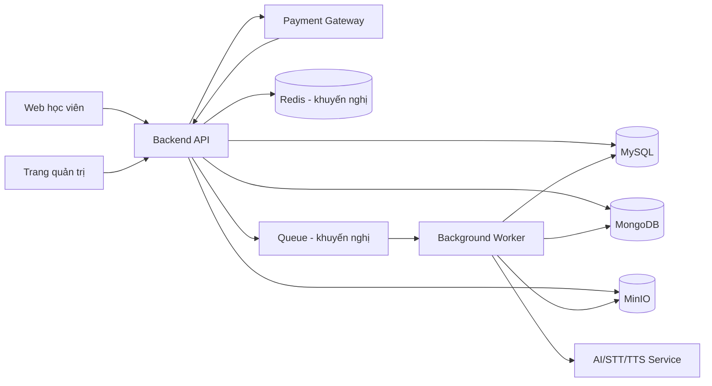
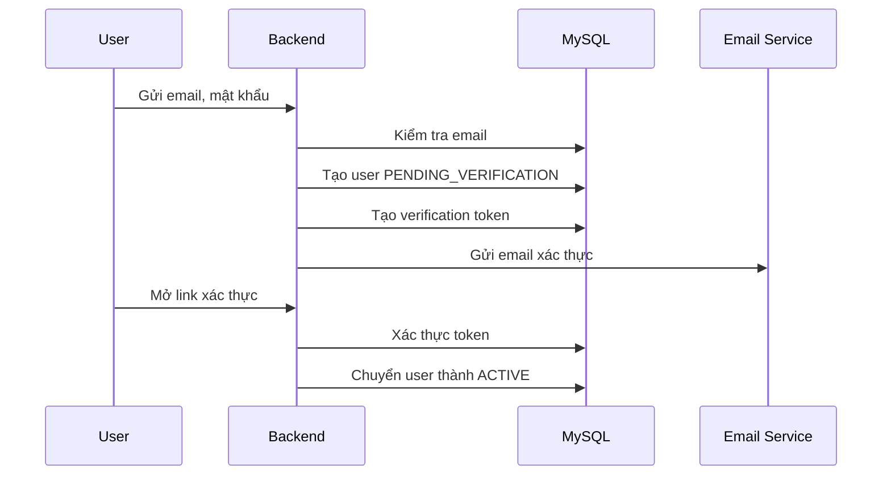
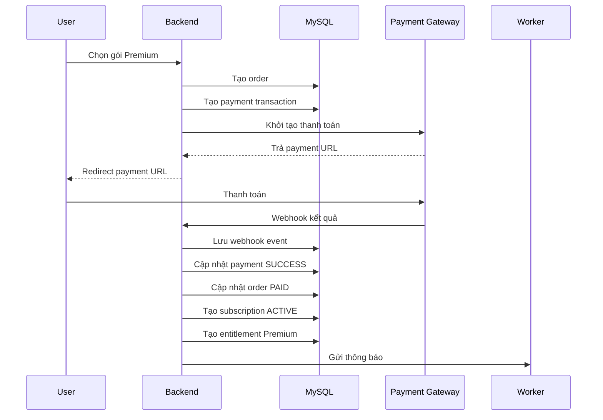

# KIẾN TRÚC HỆ THỐNG LUYỆN THI APTIS

> Công nghệ lưu trữ: **MySQL + MongoDB + MinIO**
> Mô hình kinh doanh: **Freemium**, có bài học miễn phí và bài học Premium
> Phạm vi: Đăng nhập, ngân hàng bài tập, luyện theo Part, luyện tùy chọn, thi thử, chấm điểm, tiến độ học tập, thanh toán và nâng cấp tài khoản

---

## 1. Mục tiêu hệ thống

Hệ thống được xây dựng để học viên có thể:

- Đăng ký và đăng nhập tài khoản.
- Làm bài miễn phí để trải nghiệm dịch vụ.
- Nâng cấp tài khoản Premium thông qua thanh toán trực tuyến.
- Luyện tập theo từng học phần và từng Part.
- Tạo bài luyện tùy chọn theo trình độ, chủ đề, Part và câu đã làm sai.
- Làm bài thi thử đầy đủ theo cấu trúc Aptis.
- Xem kết quả, đáp án, giải thích và lịch sử làm bài.
- Theo dõi tiến độ theo học phần, Part và dạng bài.
- Ghi âm Speaking và viết bài Writing.
- Nhận chấm điểm tự động hoặc chấm bằng AI.
- Làm lại câu sai và hạn chế gặp lại câu vừa làm.

Quản trị viên có thể:

- Quản lý học viên và quyền truy cập.
- Quản lý học phần, Part và dạng bài.
- Tạo, sửa, duyệt và xuất bản câu hỏi.
- Thiết lập câu hỏi miễn phí hoặc Premium.
- Tạo đề thi thử.
- Quản lý gói Premium, đơn hàng và giao dịch thanh toán.
- Xem báo cáo doanh thu và báo cáo học tập.
- Quản lý audio, hình ảnh và file ghi âm.
- Xem và điều chỉnh kết quả chấm AI.

---

## 2. Nguyên tắc kiến trúc

### 2.1. MySQL chịu trách nhiệm dữ liệu giao dịch

MySQL là nguồn dữ liệu chính cho:

- Tài khoản và phân quyền.
- Hồ sơ học viên.
- Phiên đăng nhập.
- Danh mục kỳ thi, học phần và Part.
- Metadata của bộ câu hỏi.
- Quyền truy cập Free/Premium.
- Gói dịch vụ và đăng ký Premium.
- Đơn hàng và thanh toán.
- Lượt làm bài.
- Điểm tổng hợp.
- Tiến độ học tập.
- Nhật ký quản trị.
- Outbox event để đồng bộ liên dịch vụ.

### 2.2. MongoDB chịu trách nhiệm dữ liệu nội dung linh hoạt

MongoDB lưu:

- Nội dung chi tiết của từng bộ câu hỏi.
- Danh sách câu hỏi con.
- Phương án trả lời.
- Cấu trúc đáp án.
- Cấu hình renderer theo từng dạng bài.
- Snapshot đề thi tại thời điểm học viên bắt đầu làm.
- Câu trả lời chi tiết của học viên.
- Transcript Speaking.
- Nội dung chấm AI và tiêu chí chấm chi tiết.
- Phiên bản lịch sử của nội dung câu hỏi.

### 2.3. MinIO chịu trách nhiệm file

MinIO lưu:

- Audio Listening.
- Ảnh Speaking.
- Ảnh minh họa Reading.
- File ghi âm Speaking của học viên.
- File đính kèm bài học.
- File import câu hỏi.
- File export báo cáo.
- Ảnh đại diện người dùng.

### 2.4. Không thực hiện transaction xuyên MySQL và MongoDB

Không sử dụng distributed transaction giữa MySQL và MongoDB.

Mỗi nghiệp vụ phải có:

- Một nguồn dữ liệu chính.
- ID dạng UUID do ứng dụng tạo.
- Cơ chế retry.
- Idempotency key.
- Outbox event hoặc hàng đợi xử lý.
- Job đối soát dữ liệu khi cần.

---

## 3. Kiến trúc tổng thể



Redis và Queue không bắt buộc trong MVP nhưng nên có khi hệ thống bắt đầu có nhiều người dùng.

---

## 4. Phân chia dữ liệu giữa ba hệ thống

| Nhóm dữ liệu | MySQL | MongoDB | MinIO |
|---|---:|---:|---:|
| Tài khoản | Có | Không | Không |
| Phân quyền | Có | Không | Không |
| Gói Premium | Có | Không | Không |
| Đơn hàng, thanh toán | Có | Không | Không |
| Danh mục học phần, Part | Có | Không | Không |
| Metadata bộ câu hỏi | Có | Có tham chiếu | Không |
| Nội dung câu hỏi | Không | Có | Không |
| Đáp án chi tiết | Không | Có | Không |
| Audio, ảnh | Metadata | Metadata | File thật |
| Lượt làm bài | Có | Snapshot chi tiết | Không |
| Câu trả lời | Tổng hợp | Chi tiết | File ghi âm |
| Điểm số | Tổng hợp | Chi tiết tiêu chí | Không |
| Tiến độ học tập | Có | Không | Không |
| Chấm AI | Trạng thái | Kết quả chi tiết | Có thể có file |
| Nhật ký quản trị | Có | Có thể bổ sung | Không |

---

# PHẦN I — THIẾT KẾ MYSQL

## 5. Quy ước chung

- Khóa chính dùng `CHAR(36)` hoặc `BINARY(16)` lưu UUID.
- Tiền lưu bằng `BIGINT`, đơn vị nhỏ nhất là đồng.
- Thời gian lưu theo UTC.
- Không xóa cứng dữ liệu quan trọng.
- Dùng `status`, `deleted_at` hoặc `is_active`.
- Mọi bảng nghiệp vụ nên có:
  - `created_at`
  - `updated_at`
  - `created_by`
  - `updated_by`
- Dữ liệu thanh toán phải có idempotency.
- Email lưu dạng lowercase.
- Password phải được hash bằng Argon2id hoặc bcrypt.

---

## 6. Nhóm bảng tài khoản và đăng nhập

### 6.1. `users`

```sql
CREATE TABLE users (
    id CHAR(36) PRIMARY KEY,
    email VARCHAR(255) NOT NULL,
    phone VARCHAR(30) NULL,
    password_hash VARCHAR(255) NULL,

    status ENUM(
        'PENDING_VERIFICATION',
        'ACTIVE',
        'LOCKED',
        'SUSPENDED',
        'DELETED'
    ) NOT NULL DEFAULT 'PENDING_VERIFICATION',

    email_verified_at DATETIME NULL,
    phone_verified_at DATETIME NULL,
    last_login_at DATETIME NULL,
    failed_login_count INT NOT NULL DEFAULT 0,
    locked_until DATETIME NULL,

    created_at DATETIME NOT NULL,
    updated_at DATETIME NOT NULL,
    deleted_at DATETIME NULL,

    UNIQUE KEY uk_users_email (email),
    UNIQUE KEY uk_users_phone (phone),
    KEY idx_users_status (status)
);
```

### 6.2. `user_profiles`

```sql
CREATE TABLE user_profiles (
    user_id CHAR(36) PRIMARY KEY,
    full_name VARCHAR(255) NULL,
    display_name VARCHAR(100) NULL,
    avatar_object_key VARCHAR(500) NULL,
    date_of_birth DATE NULL,
    gender ENUM('MALE', 'FEMALE', 'OTHER', 'UNSPECIFIED')
        NOT NULL DEFAULT 'UNSPECIFIED',

    target_cefr_level ENUM('A1', 'A2', 'B1', 'B2', 'C1', 'C2') NULL,
    target_exam_date DATE NULL,
    timezone VARCHAR(50) NOT NULL DEFAULT 'Asia/Ho_Chi_Minh',
    locale VARCHAR(20) NOT NULL DEFAULT 'vi-VN',

    created_at DATETIME NOT NULL,
    updated_at DATETIME NOT NULL,

    CONSTRAINT fk_user_profiles_user
        FOREIGN KEY (user_id) REFERENCES users(id)
);
```

### 6.3. `roles`

```sql
CREATE TABLE roles (
    id CHAR(36) PRIMARY KEY,
    code VARCHAR(50) NOT NULL,
    name VARCHAR(100) NOT NULL,
    description VARCHAR(500) NULL,
    created_at DATETIME NOT NULL,
    updated_at DATETIME NOT NULL,

    UNIQUE KEY uk_roles_code (code)
);
```

Vai trò đề xuất:

- `STUDENT`
- `CONTENT_EDITOR`
- `CONTENT_REVIEWER`
- `TEACHER`
- `SUPPORT`
- `FINANCE`
- `ADMIN`
- `SUPER_ADMIN`

### 6.4. `permissions`

```sql
CREATE TABLE permissions (
    id CHAR(36) PRIMARY KEY,
    code VARCHAR(100) NOT NULL,
    name VARCHAR(150) NOT NULL,
    description VARCHAR(500) NULL,

    UNIQUE KEY uk_permissions_code (code)
);
```

### 6.5. `user_roles`

```sql
CREATE TABLE user_roles (
    user_id CHAR(36) NOT NULL,
    role_id CHAR(36) NOT NULL,
    assigned_at DATETIME NOT NULL,
    assigned_by CHAR(36) NULL,

    PRIMARY KEY (user_id, role_id),

    CONSTRAINT fk_user_roles_user
        FOREIGN KEY (user_id) REFERENCES users(id),

    CONSTRAINT fk_user_roles_role
        FOREIGN KEY (role_id) REFERENCES roles(id)
);
```

### 6.6. `role_permissions`

```sql
CREATE TABLE role_permissions (
    role_id CHAR(36) NOT NULL,
    permission_id CHAR(36) NOT NULL,

    PRIMARY KEY (role_id, permission_id),

    CONSTRAINT fk_role_permissions_role
        FOREIGN KEY (role_id) REFERENCES roles(id),

    CONSTRAINT fk_role_permissions_permission
        FOREIGN KEY (permission_id) REFERENCES permissions(id)
);
```

### 6.7. `auth_identities`

Dùng khi hỗ trợ đăng nhập Google, Apple hoặc nền tảng khác.

```sql
CREATE TABLE auth_identities (
    id CHAR(36) PRIMARY KEY,
    user_id CHAR(36) NOT NULL,
    provider VARCHAR(50) NOT NULL,
    provider_user_id VARCHAR(255) NOT NULL,
    provider_email VARCHAR(255) NULL,
    created_at DATETIME NOT NULL,
    updated_at DATETIME NOT NULL,

    UNIQUE KEY uk_auth_identity_provider_user (
        provider,
        provider_user_id
    ),

    CONSTRAINT fk_auth_identities_user
        FOREIGN KEY (user_id) REFERENCES users(id)
);
```

### 6.8. `refresh_tokens`

```sql
CREATE TABLE refresh_tokens (
    id CHAR(36) PRIMARY KEY,
    user_id CHAR(36) NOT NULL,
    token_hash VARCHAR(255) NOT NULL,
    device_id VARCHAR(255) NULL,
    user_agent VARCHAR(1000) NULL,
    ip_address VARCHAR(64) NULL,
    expires_at DATETIME NOT NULL,
    revoked_at DATETIME NULL,
    replaced_by_token_id CHAR(36) NULL,
    created_at DATETIME NOT NULL,

    KEY idx_refresh_tokens_user (user_id),
    KEY idx_refresh_tokens_expires (expires_at),

    CONSTRAINT fk_refresh_tokens_user
        FOREIGN KEY (user_id) REFERENCES users(id)
);
```

### 6.9. `email_verification_tokens`

```sql
CREATE TABLE email_verification_tokens (
    id CHAR(36) PRIMARY KEY,
    user_id CHAR(36) NOT NULL,
    token_hash VARCHAR(255) NOT NULL,
    expires_at DATETIME NOT NULL,
    used_at DATETIME NULL,
    created_at DATETIME NOT NULL,

    KEY idx_email_verification_user (user_id),

    CONSTRAINT fk_email_verification_user
        FOREIGN KEY (user_id) REFERENCES users(id)
);
```

### 6.10. `password_reset_tokens`

```sql
CREATE TABLE password_reset_tokens (
    id CHAR(36) PRIMARY KEY,
    user_id CHAR(36) NOT NULL,
    token_hash VARCHAR(255) NOT NULL,
    expires_at DATETIME NOT NULL,
    used_at DATETIME NULL,
    created_at DATETIME NOT NULL,

    CONSTRAINT fk_password_reset_user
        FOREIGN KEY (user_id) REFERENCES users(id)
);
```

---

## 7. Nhóm bảng cấu trúc kỳ thi

### 7.1. `exam_products`

Dùng để phân biệt Aptis General, Aptis Advanced hoặc phiên bản khác.

```sql
CREATE TABLE exam_products (
    id CHAR(36) PRIMARY KEY,
    code VARCHAR(50) NOT NULL,
    name VARCHAR(255) NOT NULL,
    description TEXT NULL,
    is_active BOOLEAN NOT NULL DEFAULT TRUE,
    created_at DATETIME NOT NULL,
    updated_at DATETIME NOT NULL,

    UNIQUE KEY uk_exam_products_code (code)
);
```

### 7.2. `exam_versions`

```sql
CREATE TABLE exam_versions (
    id CHAR(36) PRIMARY KEY,
    exam_product_id CHAR(36) NOT NULL,
    code VARCHAR(100) NOT NULL,
    name VARCHAR(255) NOT NULL,
    valid_from DATE NULL,
    valid_to DATE NULL,
    status ENUM('DRAFT', 'PUBLISHED', 'ARCHIVED')
        NOT NULL DEFAULT 'DRAFT',
    created_at DATETIME NOT NULL,
    updated_at DATETIME NOT NULL,

    UNIQUE KEY uk_exam_versions_code (code),

    CONSTRAINT fk_exam_versions_product
        FOREIGN KEY (exam_product_id) REFERENCES exam_products(id)
);
```

### 7.3. `components`

```sql
CREATE TABLE components (
    id CHAR(36) PRIMARY KEY,
    exam_version_id CHAR(36) NOT NULL,
    code VARCHAR(50) NOT NULL,
    name VARCHAR(100) NOT NULL,
    description TEXT NULL,
    display_order INT NOT NULL,
    duration_seconds INT NULL,
    max_score DECIMAL(8,2) NULL,
    is_active BOOLEAN NOT NULL DEFAULT TRUE,
    created_at DATETIME NOT NULL,
    updated_at DATETIME NOT NULL,

    UNIQUE KEY uk_components_version_code (
        exam_version_id,
        code
    ),

    CONSTRAINT fk_components_exam_version
        FOREIGN KEY (exam_version_id) REFERENCES exam_versions(id)
);
```

Mã học phần đề xuất:

- `GRAMMAR_VOCABULARY`
- `READING`
- `LISTENING`
- `SPEAKING`
- `WRITING`

### 7.4. `parts`

```sql
CREATE TABLE parts (
    id CHAR(36) PRIMARY KEY,
    component_id CHAR(36) NOT NULL,
    code VARCHAR(50) NOT NULL,
    name VARCHAR(255) NOT NULL,
    description TEXT NULL,
    instructions TEXT NULL,
    display_order INT NOT NULL,
    default_duration_seconds INT NULL,
    is_active BOOLEAN NOT NULL DEFAULT TRUE,
    created_at DATETIME NOT NULL,
    updated_at DATETIME NOT NULL,

    UNIQUE KEY uk_parts_component_code (
        component_id,
        code
    ),

    KEY idx_parts_component_order (
        component_id,
        display_order
    ),

    CONSTRAINT fk_parts_component
        FOREIGN KEY (component_id) REFERENCES components(id)
);
```

### 7.5. `task_types`

```sql
CREATE TABLE task_types (
    id CHAR(36) PRIMARY KEY,
    code VARCHAR(100) NOT NULL,
    name VARCHAR(255) NOT NULL,
    renderer_key VARCHAR(100) NOT NULL,
    validator_key VARCHAR(100) NULL,
    response_type VARCHAR(50) NOT NULL,
    schema_version INT NOT NULL DEFAULT 1,
    is_active BOOLEAN NOT NULL DEFAULT TRUE,
    created_at DATETIME NOT NULL,
    updated_at DATETIME NOT NULL,

    UNIQUE KEY uk_task_types_code (code)
);
```

Dạng bài nên hỗ trợ:

- `SINGLE_CHOICE`
- `MULTIPLE_CHOICE`
- `GAP_FILL_CHOICE`
- `MATCHING`
- `SPEAKER_MATCHING`
- `HEADING_MATCHING`
- `SENTENCE_ORDERING`
- `SHORT_TEXT`
- `LONG_TEXT`
- `AUDIO_RECORDING`
- `IMAGE_DESCRIPTION`
- `IMAGE_COMPARISON`

### 7.6. `topics`

```sql
CREATE TABLE topics (
    id CHAR(36) PRIMARY KEY,
    parent_id CHAR(36) NULL,
    code VARCHAR(100) NOT NULL,
    name VARCHAR(255) NOT NULL,
    description TEXT NULL,
    is_active BOOLEAN NOT NULL DEFAULT TRUE,
    created_at DATETIME NOT NULL,
    updated_at DATETIME NOT NULL,

    UNIQUE KEY uk_topics_code (code),

    CONSTRAINT fk_topics_parent
        FOREIGN KEY (parent_id) REFERENCES topics(id)
);
```

---

## 8. Metadata ngân hàng câu hỏi trong MySQL

### 8.1. `question_sets`

MySQL chỉ lưu metadata để tìm kiếm, phân quyền, tạo đề và báo cáo.

Nội dung chi tiết được lưu trong MongoDB.

```sql
CREATE TABLE question_sets (
    id CHAR(36) PRIMARY KEY,
    part_id CHAR(36) NOT NULL,
    task_type_id CHAR(36) NOT NULL,
    topic_id CHAR(36) NULL,

    code VARCHAR(100) NOT NULL,
    title VARCHAR(255) NULL,

    difficulty TINYINT NULL,
    cefr_min ENUM('A1', 'A2', 'B1', 'B2', 'C1', 'C2') NULL,
    cefr_max ENUM('A1', 'A2', 'B1', 'B2', 'C1', 'C2') NULL,

    access_level ENUM('FREE', 'PREMIUM')
        NOT NULL DEFAULT 'PREMIUM',

    status ENUM(
        'DRAFT',
        'IN_REVIEW',
        'PUBLISHED',
        'SUSPENDED',
        'ARCHIVED'
    ) NOT NULL DEFAULT 'DRAFT',

    current_revision INT NOT NULL DEFAULT 1,
    mongo_document_id VARCHAR(100) NULL,
    content_checksum VARCHAR(128) NULL,

    estimated_seconds INT NULL,
    max_score DECIMAL(8,2) NOT NULL DEFAULT 1,
    published_at DATETIME NULL,

    created_by CHAR(36) NULL,
    updated_by CHAR(36) NULL,
    created_at DATETIME NOT NULL,
    updated_at DATETIME NOT NULL,

    UNIQUE KEY uk_question_sets_code (code),

    KEY idx_question_sets_filter (
        part_id,
        status,
        access_level,
        difficulty
    ),

    KEY idx_question_sets_topic (topic_id),
    KEY idx_question_sets_task_type (task_type_id),

    CONSTRAINT fk_question_sets_part
        FOREIGN KEY (part_id) REFERENCES parts(id),

    CONSTRAINT fk_question_sets_task_type
        FOREIGN KEY (task_type_id) REFERENCES task_types(id),

    CONSTRAINT fk_question_sets_topic
        FOREIGN KEY (topic_id) REFERENCES topics(id)
);
```

### 8.2. `question_set_tags`

```sql
CREATE TABLE tags (
    id CHAR(36) PRIMARY KEY,
    code VARCHAR(100) NOT NULL,
    name VARCHAR(255) NOT NULL,

    UNIQUE KEY uk_tags_code (code)
);

CREATE TABLE question_set_tags (
    question_set_id CHAR(36) NOT NULL,
    tag_id CHAR(36) NOT NULL,

    PRIMARY KEY (question_set_id, tag_id),

    CONSTRAINT fk_question_set_tags_question
        FOREIGN KEY (question_set_id) REFERENCES question_sets(id),

    CONSTRAINT fk_question_set_tags_tag
        FOREIGN KEY (tag_id) REFERENCES tags(id)
);
```

---

## 9. Thiết lập nội dung Free và Premium

### 9.1. Nguyên tắc

Mỗi bộ câu hỏi có một mức truy cập:

- `FREE`: học viên đã đăng nhập có thể học.
- `PREMIUM`: chỉ học viên có quyền Premium còn hiệu lực mới được học.

Không nên kiểm tra Premium chỉ ở giao diện.

Backend bắt buộc phải kiểm tra quyền trước khi:

- Trả nội dung câu hỏi.
- Tạo lượt làm bài.
- Phát audio.
- Cấp URL tải file.
- Chấm hoặc xem lời giải Premium.

### 9.2. Bảng `content_access_overrides`

Cho phép ghi đè quyền ở từng chiến dịch hoặc từng học viên.

```sql
CREATE TABLE content_access_overrides (
    id CHAR(36) PRIMARY KEY,
    resource_type ENUM(
        'QUESTION_SET',
        'COMPONENT',
        'PART',
        'MOCK_TEST'
    ) NOT NULL,

    resource_id CHAR(36) NOT NULL,
    access_level ENUM('FREE', 'PREMIUM') NOT NULL,

    user_id CHAR(36) NULL,
    starts_at DATETIME NULL,
    ends_at DATETIME NULL,
    reason VARCHAR(500) NULL,

    created_by CHAR(36) NULL,
    created_at DATETIME NOT NULL,

    KEY idx_content_access_resource (
        resource_type,
        resource_id
    ),

    KEY idx_content_access_user (
        user_id,
        starts_at,
        ends_at
    )
);
```

Ví dụ sử dụng:

- Mở miễn phí Reading Part 1 trong 7 ngày.
- Tặng riêng một học viên quyền làm một đề Premium.
- Mở toàn bộ một học phần trong chiến dịch khuyến mại.

---

## 10. Gói dịch vụ và quyền Premium

### 10.1. `subscription_plans`

```sql
CREATE TABLE subscription_plans (
    id CHAR(36) PRIMARY KEY,
    code VARCHAR(100) NOT NULL,
    name VARCHAR(255) NOT NULL,
    description TEXT NULL,

    billing_type ENUM(
        'ONE_TIME',
        'RECURRING'
    ) NOT NULL DEFAULT 'ONE_TIME',

    duration_days INT NULL,
    price_amount BIGINT NOT NULL,
    currency VARCHAR(10) NOT NULL DEFAULT 'VND',

    status ENUM(
        'DRAFT',
        'ACTIVE',
        'INACTIVE',
        'ARCHIVED'
    ) NOT NULL DEFAULT 'DRAFT',

    display_order INT NOT NULL DEFAULT 0,
    created_at DATETIME NOT NULL,
    updated_at DATETIME NOT NULL,

    UNIQUE KEY uk_subscription_plans_code (code)
);
```

Ví dụ:

- Premium 30 ngày.
- Premium 90 ngày.
- Premium 180 ngày.
- Premium 365 ngày.
- Premium trọn đời.

### 10.2. `plan_features`

```sql
CREATE TABLE plan_features (
    id CHAR(36) PRIMARY KEY,
    plan_id CHAR(36) NOT NULL,
    feature_code VARCHAR(100) NOT NULL,
    feature_value VARCHAR(500) NULL,
    display_name VARCHAR(255) NULL,
    display_order INT NOT NULL DEFAULT 0,

    UNIQUE KEY uk_plan_features (
        plan_id,
        feature_code
    ),

    CONSTRAINT fk_plan_features_plan
        FOREIGN KEY (plan_id) REFERENCES subscription_plans(id)
);
```

Feature đề xuất:

- `PREMIUM_CONTENT_ACCESS`
- `UNLIMITED_PRACTICE`
- `FULL_MOCK_TEST`
- `AI_WRITING_FEEDBACK`
- `AI_SPEAKING_FEEDBACK`
- `DETAILED_ANALYTICS`
- `DOWNLOAD_REPORT`

### 10.3. `user_subscriptions`

```sql
CREATE TABLE user_subscriptions (
    id CHAR(36) PRIMARY KEY,
    user_id CHAR(36) NOT NULL,
    plan_id CHAR(36) NOT NULL,

    status ENUM(
        'PENDING',
        'ACTIVE',
        'EXPIRED',
        'CANCELLED',
        'REVOKED'
    ) NOT NULL DEFAULT 'PENDING',

    starts_at DATETIME NULL,
    ends_at DATETIME NULL,
    auto_renew BOOLEAN NOT NULL DEFAULT FALSE,

    source_order_id CHAR(36) NULL,
    activated_at DATETIME NULL,
    cancelled_at DATETIME NULL,
    revoked_at DATETIME NULL,
    revoke_reason VARCHAR(500) NULL,

    created_at DATETIME NOT NULL,
    updated_at DATETIME NOT NULL,

    KEY idx_user_subscriptions_active (
        user_id,
        status,
        starts_at,
        ends_at
    ),

    CONSTRAINT fk_user_subscriptions_user
        FOREIGN KEY (user_id) REFERENCES users(id),

    CONSTRAINT fk_user_subscriptions_plan
        FOREIGN KEY (plan_id) REFERENCES subscription_plans(id)
);
```

### 10.4. `user_entitlements`

Bảng quyền thực tế dùng khi kiểm tra truy cập.

```sql
CREATE TABLE user_entitlements (
    id CHAR(36) PRIMARY KEY,
    user_id CHAR(36) NOT NULL,
    entitlement_code VARCHAR(100) NOT NULL,

    source_type ENUM(
        'SUBSCRIPTION',
        'PROMOTION',
        'ADMIN_GRANT',
        'TRIAL'
    ) NOT NULL,

    source_id CHAR(36) NULL,
    starts_at DATETIME NOT NULL,
    ends_at DATETIME NULL,
    revoked_at DATETIME NULL,

    created_at DATETIME NOT NULL,
    updated_at DATETIME NOT NULL,

    KEY idx_entitlements_check (
        user_id,
        entitlement_code,
        starts_at,
        ends_at,
        revoked_at
    ),

    CONSTRAINT fk_user_entitlements_user
        FOREIGN KEY (user_id) REFERENCES users(id)
);
```

Quyền Premium được xác định bằng entitlement:

```text
PREMIUM_CONTENT_ACCESS
```

Không nên chỉ kiểm tra một cột `users.is_premium`, vì:

- Có thời hạn.
- Có thể có nhiều gói.
- Có thể tặng quyền.
- Có thể thu hồi.
- Có thể mở từng tính năng riêng.

---

## 11. Dùng thử Premium

### 11.1. `trial_campaigns`

```sql
CREATE TABLE trial_campaigns (
    id CHAR(36) PRIMARY KEY,
    code VARCHAR(100) NOT NULL,
    name VARCHAR(255) NOT NULL,
    duration_days INT NOT NULL,
    max_uses_per_user INT NOT NULL DEFAULT 1,
    starts_at DATETIME NULL,
    ends_at DATETIME NULL,
    status ENUM('DRAFT', 'ACTIVE', 'INACTIVE', 'ENDED')
        NOT NULL DEFAULT 'DRAFT',
    created_at DATETIME NOT NULL,
    updated_at DATETIME NOT NULL,

    UNIQUE KEY uk_trial_campaigns_code (code)
);
```

### 11.2. `user_trials`

```sql
CREATE TABLE user_trials (
    id CHAR(36) PRIMARY KEY,
    user_id CHAR(36) NOT NULL,
    campaign_id CHAR(36) NOT NULL,
    starts_at DATETIME NOT NULL,
    ends_at DATETIME NOT NULL,
    status ENUM('ACTIVE', 'EXPIRED', 'CANCELLED')
        NOT NULL DEFAULT 'ACTIVE',
    created_at DATETIME NOT NULL,
    updated_at DATETIME NOT NULL,

    KEY idx_user_trials_active (
        user_id,
        starts_at,
        ends_at,
        status
    ),

    CONSTRAINT fk_user_trials_user
        FOREIGN KEY (user_id) REFERENCES users(id),

    CONSTRAINT fk_user_trials_campaign
        FOREIGN KEY (campaign_id) REFERENCES trial_campaigns(id)
);
```

MVP có thể chưa cần trial theo thời gian nếu đã có ngân hàng bài `FREE`.

---

## 12. Đơn hàng và thanh toán

### 12.1. `orders`

```sql
CREATE TABLE orders (
    id CHAR(36) PRIMARY KEY,
    order_code VARCHAR(50) NOT NULL,
    user_id CHAR(36) NOT NULL,

    status ENUM(
        'PENDING',
        'AWAITING_PAYMENT',
        'PAID',
        'CANCELLED',
        'EXPIRED',
        'REFUNDED',
        'PARTIALLY_REFUNDED'
    ) NOT NULL DEFAULT 'PENDING',

    subtotal_amount BIGINT NOT NULL,
    discount_amount BIGINT NOT NULL DEFAULT 0,
    total_amount BIGINT NOT NULL,
    currency VARCHAR(10) NOT NULL DEFAULT 'VND',

    idempotency_key VARCHAR(255) NOT NULL,
    expires_at DATETIME NULL,
    paid_at DATETIME NULL,
    cancelled_at DATETIME NULL,

    created_at DATETIME NOT NULL,
    updated_at DATETIME NOT NULL,

    UNIQUE KEY uk_orders_code (order_code),
    UNIQUE KEY uk_orders_idempotency (idempotency_key),
    KEY idx_orders_user_status (user_id, status),

    CONSTRAINT fk_orders_user
        FOREIGN KEY (user_id) REFERENCES users(id)
);
```

### 12.2. `order_items`

```sql
CREATE TABLE order_items (
    id CHAR(36) PRIMARY KEY,
    order_id CHAR(36) NOT NULL,
    item_type ENUM('SUBSCRIPTION_PLAN') NOT NULL,
    item_id CHAR(36) NOT NULL,

    item_name VARCHAR(255) NOT NULL,
    quantity INT NOT NULL DEFAULT 1,
    unit_price BIGINT NOT NULL,
    discount_amount BIGINT NOT NULL DEFAULT 0,
    total_amount BIGINT NOT NULL,

    metadata_json JSON NULL,

    CONSTRAINT fk_order_items_order
        FOREIGN KEY (order_id) REFERENCES orders(id)
);
```

### 12.3. `payment_transactions`

```sql
CREATE TABLE payment_transactions (
    id CHAR(36) PRIMARY KEY,
    order_id CHAR(36) NOT NULL,

    provider VARCHAR(50) NOT NULL,
    provider_transaction_id VARCHAR(255) NULL,
    provider_order_id VARCHAR(255) NULL,

    status ENUM(
        'INITIATED',
        'PENDING',
        'SUCCESS',
        'FAILED',
        'CANCELLED',
        'EXPIRED',
        'REFUNDED'
    ) NOT NULL DEFAULT 'INITIATED',

    amount BIGINT NOT NULL,
    currency VARCHAR(10) NOT NULL DEFAULT 'VND',

    idempotency_key VARCHAR(255) NOT NULL,
    payment_url TEXT NULL,

    initiated_at DATETIME NOT NULL,
    completed_at DATETIME NULL,
    failed_at DATETIME NULL,

    error_code VARCHAR(100) NULL,
    error_message VARCHAR(1000) NULL,

    raw_request_json JSON NULL,
    raw_response_json JSON NULL,

    created_at DATETIME NOT NULL,
    updated_at DATETIME NOT NULL,

    UNIQUE KEY uk_payment_idempotency (idempotency_key),

    KEY idx_payment_order (order_id),
    KEY idx_payment_provider_transaction (
        provider,
        provider_transaction_id
    ),

    CONSTRAINT fk_payment_transactions_order
        FOREIGN KEY (order_id) REFERENCES orders(id)
);
```

### 12.4. `payment_webhook_events`

```sql
CREATE TABLE payment_webhook_events (
    id CHAR(36) PRIMARY KEY,
    provider VARCHAR(50) NOT NULL,
    provider_event_id VARCHAR(255) NULL,
    signature_valid BOOLEAN NOT NULL DEFAULT FALSE,

    event_type VARCHAR(100) NULL,
    payload_json JSON NOT NULL,

    processing_status ENUM(
        'RECEIVED',
        'PROCESSING',
        'PROCESSED',
        'FAILED',
        'IGNORED'
    ) NOT NULL DEFAULT 'RECEIVED',

    error_message TEXT NULL,
    received_at DATETIME NOT NULL,
    processed_at DATETIME NULL,

    UNIQUE KEY uk_webhook_provider_event (
        provider,
        provider_event_id
    )
);
```

### 12.5. `refunds`

```sql
CREATE TABLE refunds (
    id CHAR(36) PRIMARY KEY,
    order_id CHAR(36) NOT NULL,
    payment_transaction_id CHAR(36) NOT NULL,

    amount BIGINT NOT NULL,
    reason VARCHAR(1000) NULL,

    status ENUM(
        'REQUESTED',
        'PROCESSING',
        'SUCCESS',
        'FAILED',
        'REJECTED'
    ) NOT NULL DEFAULT 'REQUESTED',

    provider_refund_id VARCHAR(255) NULL,
    requested_by CHAR(36) NULL,
    requested_at DATETIME NOT NULL,
    completed_at DATETIME NULL,

    CONSTRAINT fk_refunds_order
        FOREIGN KEY (order_id) REFERENCES orders(id),

    CONSTRAINT fk_refunds_payment
        FOREIGN KEY (payment_transaction_id)
        REFERENCES payment_transactions(id)
);
```

---

## 13. Mã giảm giá

### 13.1. `promotion_codes`

```sql
CREATE TABLE promotion_codes (
    id CHAR(36) PRIMARY KEY,
    code VARCHAR(100) NOT NULL,

    discount_type ENUM('FIXED_AMOUNT', 'PERCENTAGE') NOT NULL,
    discount_value BIGINT NOT NULL,

    max_discount_amount BIGINT NULL,
    min_order_amount BIGINT NULL,
    max_total_uses INT NULL,
    max_uses_per_user INT NULL,

    starts_at DATETIME NULL,
    ends_at DATETIME NULL,

    status ENUM('DRAFT', 'ACTIVE', 'INACTIVE', 'ENDED')
        NOT NULL DEFAULT 'DRAFT',

    created_at DATETIME NOT NULL,
    updated_at DATETIME NOT NULL,

    UNIQUE KEY uk_promotion_codes_code (code)
);
```

### 13.2. `promotion_redemptions`

```sql
CREATE TABLE promotion_redemptions (
    id CHAR(36) PRIMARY KEY,
    promotion_code_id CHAR(36) NOT NULL,
    user_id CHAR(36) NOT NULL,
    order_id CHAR(36) NOT NULL,
    discount_amount BIGINT NOT NULL,
    redeemed_at DATETIME NOT NULL,

    KEY idx_redemptions_user (
        promotion_code_id,
        user_id
    )
);
```

---

## 14. Cấu hình bài luyện và đề thi

### 14.1. `test_blueprints`

```sql
CREATE TABLE test_blueprints (
    id CHAR(36) PRIMARY KEY,
    exam_version_id CHAR(36) NOT NULL,
    component_id CHAR(36) NULL,

    code VARCHAR(100) NOT NULL,
    name VARCHAR(255) NOT NULL,

    mode ENUM(
        'PART_PRACTICE',
        'CUSTOM_PRACTICE',
        'MOCK_TEST'
    ) NOT NULL,

    access_level ENUM('FREE', 'PREMIUM')
        NOT NULL DEFAULT 'PREMIUM',

    duration_seconds INT NULL,
    status ENUM('DRAFT', 'PUBLISHED', 'ARCHIVED')
        NOT NULL DEFAULT 'DRAFT',

    created_at DATETIME NOT NULL,
    updated_at DATETIME NOT NULL,

    UNIQUE KEY uk_test_blueprints_code (code),

    CONSTRAINT fk_test_blueprints_exam_version
        FOREIGN KEY (exam_version_id) REFERENCES exam_versions(id),

    CONSTRAINT fk_test_blueprints_component
        FOREIGN KEY (component_id) REFERENCES components(id)
);
```

### 14.2. `blueprint_part_rules`

```sql
CREATE TABLE blueprint_part_rules (
    id CHAR(36) PRIMARY KEY,
    blueprint_id CHAR(36) NOT NULL,
    part_id CHAR(36) NOT NULL,

    question_set_count INT NOT NULL,
    difficulty_min TINYINT NULL,
    difficulty_max TINYINT NULL,

    selection_strategy ENUM(
        'RANDOM',
        'NEW_FIRST',
        'WEAK_FIRST',
        'FIXED'
    ) NOT NULL DEFAULT 'RANDOM',

    allow_free_content BOOLEAN NOT NULL DEFAULT TRUE,
    allow_premium_content BOOLEAN NOT NULL DEFAULT TRUE,

    config_json JSON NULL,
    display_order INT NOT NULL,

    KEY idx_blueprint_rules_blueprint (
        blueprint_id,
        display_order
    ),

    CONSTRAINT fk_blueprint_rules_blueprint
        FOREIGN KEY (blueprint_id) REFERENCES test_blueprints(id),

    CONSTRAINT fk_blueprint_rules_part
        FOREIGN KEY (part_id) REFERENCES parts(id)
);
```

### 14.3. `blueprint_fixed_question_sets`

```sql
CREATE TABLE blueprint_fixed_question_sets (
    blueprint_rule_id CHAR(36) NOT NULL,
    question_set_id CHAR(36) NOT NULL,
    display_order INT NOT NULL,

    PRIMARY KEY (
        blueprint_rule_id,
        question_set_id
    )
);
```

---

## 15. Lượt làm bài

### 15.1. `test_attempts`

```sql
CREATE TABLE test_attempts (
    id CHAR(36) PRIMARY KEY,
    user_id CHAR(36) NOT NULL,

    blueprint_id CHAR(36) NULL,
    component_id CHAR(36) NULL,
    part_id CHAR(36) NULL,

    mode ENUM(
        'PART_PRACTICE',
        'CUSTOM_PRACTICE',
        'MOCK_TEST'
    ) NOT NULL,

    access_level_used ENUM('FREE', 'PREMIUM') NOT NULL,

    status ENUM(
        'CREATED',
        'IN_PROGRESS',
        'SUBMITTED',
        'SCORING',
        'COMPLETED',
        'EXPIRED',
        'ABANDONED',
        'CANCELLED'
    ) NOT NULL DEFAULT 'CREATED',

    mongo_attempt_document_id VARCHAR(100) NULL,

    started_at DATETIME NULL,
    submitted_at DATETIME NULL,
    completed_at DATETIME NULL,
    expires_at DATETIME NULL,

    duration_seconds INT NULL,
    time_spent_seconds INT NOT NULL DEFAULT 0,

    raw_score DECIMAL(10,2) NULL,
    max_score DECIMAL(10,2) NULL,
    percentage_score DECIMAL(8,4) NULL,
    scaled_score DECIMAL(10,2) NULL,
    cefr_level ENUM('A1', 'A2', 'B1', 'B2', 'C1', 'C2') NULL,

    total_items INT NOT NULL DEFAULT 0,
    answered_items INT NOT NULL DEFAULT 0,
    correct_items INT NOT NULL DEFAULT 0,
    incorrect_items INT NOT NULL DEFAULT 0,

    created_at DATETIME NOT NULL,
    updated_at DATETIME NOT NULL,

    KEY idx_attempts_user_created (
        user_id,
        created_at
    ),

    KEY idx_attempts_user_status (
        user_id,
        status
    ),

    CONSTRAINT fk_test_attempts_user
        FOREIGN KEY (user_id) REFERENCES users(id)
);
```

### 15.2. `attempt_question_sets`

Lưu danh sách bộ câu hỏi đã được chọn vào lượt làm bài.

```sql
CREATE TABLE attempt_question_sets (
    id CHAR(36) PRIMARY KEY,
    attempt_id CHAR(36) NOT NULL,
    question_set_id CHAR(36) NOT NULL,
    question_revision INT NOT NULL,
    display_order INT NOT NULL,

    mongo_snapshot_key VARCHAR(255) NOT NULL,

    max_score DECIMAL(8,2) NOT NULL DEFAULT 1,
    awarded_score DECIMAL(8,2) NULL,
    status ENUM(
        'NOT_STARTED',
        'IN_PROGRESS',
        'ANSWERED',
        'SCORED',
        'SKIPPED'
    ) NOT NULL DEFAULT 'NOT_STARTED',

    started_at DATETIME NULL,
    answered_at DATETIME NULL,

    UNIQUE KEY uk_attempt_question_set_order (
        attempt_id,
        display_order
    ),

    UNIQUE KEY uk_attempt_question_set_unique (
        attempt_id,
        question_set_id
    ),

    CONSTRAINT fk_attempt_question_sets_attempt
        FOREIGN KEY (attempt_id) REFERENCES test_attempts(id),

    CONSTRAINT fk_attempt_question_sets_question
        FOREIGN KEY (question_set_id) REFERENCES question_sets(id)
);
```

### 15.3. `attempt_component_scores`

```sql
CREATE TABLE attempt_component_scores (
    id CHAR(36) PRIMARY KEY,
    attempt_id CHAR(36) NOT NULL,
    component_id CHAR(36) NOT NULL,

    raw_score DECIMAL(10,2) NULL,
    max_score DECIMAL(10,2) NULL,
    percentage_score DECIMAL(8,4) NULL,
    scaled_score DECIMAL(10,2) NULL,
    cefr_level ENUM('A1', 'A2', 'B1', 'B2', 'C1', 'C2') NULL,

    UNIQUE KEY uk_attempt_component_score (
        attempt_id,
        component_id
    )
);
```

### 15.4. `attempt_part_scores`

```sql
CREATE TABLE attempt_part_scores (
    id CHAR(36) PRIMARY KEY,
    attempt_id CHAR(36) NOT NULL,
    part_id CHAR(36) NOT NULL,

    raw_score DECIMAL(10,2) NULL,
    max_score DECIMAL(10,2) NULL,
    percentage_score DECIMAL(8,4) NULL,

    total_items INT NOT NULL DEFAULT 0,
    correct_items INT NOT NULL DEFAULT 0,
    incorrect_items INT NOT NULL DEFAULT 0,

    UNIQUE KEY uk_attempt_part_score (
        attempt_id,
        part_id
    )
);
```

---

## 16. Tiến độ học tập

### 16.1. `user_question_stats`

```sql
CREATE TABLE user_question_stats (
    user_id CHAR(36) NOT NULL,
    question_set_id CHAR(36) NOT NULL,

    attempt_count INT NOT NULL DEFAULT 0,
    correct_count INT NOT NULL DEFAULT 0,
    incorrect_count INT NOT NULL DEFAULT 0,

    mastery_score DECIMAL(8,4) NOT NULL DEFAULT 0,
    average_score DECIMAL(8,4) NOT NULL DEFAULT 0,

    last_attempted_at DATETIME NULL,
    last_correct_at DATETIME NULL,
    last_incorrect_at DATETIME NULL,
    next_review_at DATETIME NULL,

    PRIMARY KEY (user_id, question_set_id),

    KEY idx_user_question_review (
        user_id,
        next_review_at
    )
);
```

### 16.2. `user_part_progress`

```sql
CREATE TABLE user_part_progress (
    user_id CHAR(36) NOT NULL,
    part_id CHAR(36) NOT NULL,

    total_attempts INT NOT NULL DEFAULT 0,
    completed_question_sets INT NOT NULL DEFAULT 0,
    mastery_score DECIMAL(8,4) NOT NULL DEFAULT 0,
    average_score DECIMAL(8,4) NOT NULL DEFAULT 0,
    study_seconds BIGINT NOT NULL DEFAULT 0,
    last_studied_at DATETIME NULL,

    PRIMARY KEY (user_id, part_id)
);
```

### 16.3. `user_component_progress`

```sql
CREATE TABLE user_component_progress (
    user_id CHAR(36) NOT NULL,
    component_id CHAR(36) NOT NULL,

    total_attempts INT NOT NULL DEFAULT 0,
    mastery_score DECIMAL(8,4) NOT NULL DEFAULT 0,
    average_score DECIMAL(8,4) NOT NULL DEFAULT 0,
    study_seconds BIGINT NOT NULL DEFAULT 0,
    estimated_cefr_level ENUM(
        'A1', 'A2', 'B1', 'B2', 'C1', 'C2'
    ) NULL,
    last_studied_at DATETIME NULL,

    PRIMARY KEY (user_id, component_id)
);
```

### 16.4. `user_daily_learning_stats`

```sql
CREATE TABLE user_daily_learning_stats (
    user_id CHAR(36) NOT NULL,
    stat_date DATE NOT NULL,

    study_seconds INT NOT NULL DEFAULT 0,
    attempts_started INT NOT NULL DEFAULT 0,
    attempts_completed INT NOT NULL DEFAULT 0,
    answered_items INT NOT NULL DEFAULT 0,
    correct_items INT NOT NULL DEFAULT 0,

    PRIMARY KEY (user_id, stat_date)
);
```

---

## 17. Asset metadata

### 17.1. `assets`

```sql
CREATE TABLE assets (
    id CHAR(36) PRIMARY KEY,

    bucket_name VARCHAR(100) NOT NULL,
    object_key VARCHAR(1000) NOT NULL,

    asset_type ENUM(
        'IMAGE',
        'AUDIO',
        'VIDEO',
        'DOCUMENT',
        'USER_RECORDING',
        'AVATAR',
        'IMPORT_FILE',
        'EXPORT_FILE'
    ) NOT NULL,

    mime_type VARCHAR(100) NOT NULL,
    original_filename VARCHAR(500) NULL,
    file_size BIGINT NULL,
    checksum_sha256 VARCHAR(128) NULL,

    duration_ms BIGINT NULL,
    width INT NULL,
    height INT NULL,

    access_scope ENUM(
        'PUBLIC',
        'PRIVATE',
        'SIGNED_URL'
    ) NOT NULL DEFAULT 'SIGNED_URL',

    status ENUM(
        'UPLOADING',
        'READY',
        'FAILED',
        'DELETED'
    ) NOT NULL DEFAULT 'UPLOADING',

    created_by CHAR(36) NULL,
    created_at DATETIME NOT NULL,
    updated_at DATETIME NOT NULL,

    UNIQUE KEY uk_assets_bucket_object (
        bucket_name,
        object_key
    )
);
```

---

## 18. AI và chấm bài

### 18.1. `evaluation_jobs`

```sql
CREATE TABLE evaluation_jobs (
    id CHAR(36) PRIMARY KEY,
    attempt_id CHAR(36) NOT NULL,
    question_set_id CHAR(36) NOT NULL,
    user_id CHAR(36) NOT NULL,

    evaluation_type ENUM(
        'SPEAKING_AI',
        'WRITING_AI',
        'SPEAKING_TEACHER',
        'WRITING_TEACHER'
    ) NOT NULL,

    status ENUM(
        'QUEUED',
        'PROCESSING',
        'COMPLETED',
        'FAILED',
        'CANCELLED'
    ) NOT NULL DEFAULT 'QUEUED',

    mongo_evaluation_document_id VARCHAR(100) NULL,

    retry_count INT NOT NULL DEFAULT 0,
    error_message TEXT NULL,

    queued_at DATETIME NOT NULL,
    started_at DATETIME NULL,
    completed_at DATETIME NULL
);
```

### 18.2. `evaluation_summaries`

```sql
CREATE TABLE evaluation_summaries (
    id CHAR(36) PRIMARY KEY,
    evaluation_job_id CHAR(36) NOT NULL,
    attempt_id CHAR(36) NOT NULL,
    question_set_id CHAR(36) NOT NULL,

    evaluator_type ENUM('AI', 'TEACHER', 'MODERATOR') NOT NULL,
    total_score DECIMAL(8,2) NULL,
    max_score DECIMAL(8,2) NULL,
    cefr_level ENUM('A1', 'A2', 'B1', 'B2', 'C1', 'C2') NULL,

    is_final BOOLEAN NOT NULL DEFAULT FALSE,
    created_at DATETIME NOT NULL,

    KEY idx_evaluation_final (
        attempt_id,
        question_set_id,
        is_final
    )
);
```

---

## 19. Nhật ký quản trị và bảo mật

### 19.1. `audit_logs`

```sql
CREATE TABLE audit_logs (
    id CHAR(36) PRIMARY KEY,
    actor_user_id CHAR(36) NULL,

    action VARCHAR(100) NOT NULL,
    resource_type VARCHAR(100) NOT NULL,
    resource_id CHAR(36) NULL,

    before_json JSON NULL,
    after_json JSON NULL,

    ip_address VARCHAR(64) NULL,
    user_agent VARCHAR(1000) NULL,

    created_at DATETIME NOT NULL,

    KEY idx_audit_resource (
        resource_type,
        resource_id,
        created_at
    ),

    KEY idx_audit_actor (
        actor_user_id,
        created_at
    )
);
```

### 19.2. `outbox_events`

```sql
CREATE TABLE outbox_events (
    id CHAR(36) PRIMARY KEY,
    aggregate_type VARCHAR(100) NOT NULL,
    aggregate_id CHAR(36) NOT NULL,
    event_type VARCHAR(100) NOT NULL,
    payload_json JSON NOT NULL,

    status ENUM(
        'PENDING',
        'PROCESSING',
        'PUBLISHED',
        'FAILED'
    ) NOT NULL DEFAULT 'PENDING',

    retry_count INT NOT NULL DEFAULT 0,
    available_at DATETIME NOT NULL,
    created_at DATETIME NOT NULL,
    published_at DATETIME NULL,

    KEY idx_outbox_pending (
        status,
        available_at
    )
);
```

---

# PHẦN II — THIẾT KẾ MONGODB

## 20. Collection `question_set_documents`

Mỗi document đại diện cho một bộ câu hỏi.

```json
{
  "_id": "question_set_uuid",
  "questionSetId": "question_set_uuid",
  "revision": 3,
  "schemaVersion": 1,

  "partId": "part_uuid",
  "taskTypeCode": "HEADING_MATCHING",

  "title": "Reading Part 4 - Environment",
  "instructions": "Match each paragraph with the correct heading.",

  "accessLevel": "PREMIUM",

  "stimulus": {
    "type": "RICH_TEXT",
    "content": {
      "format": "HTML",
      "value": "<p>...</p>"
    }
  },

  "sections": [
    {
      "id": "paragraph_1",
      "label": "Paragraph 1",
      "content": {
        "format": "HTML",
        "value": "<p>...</p>"
      }
    }
  ],

  "items": [
    {
      "id": "item_1",
      "sequenceNo": 1,
      "prompt": {
        "format": "PLAIN_TEXT",
        "value": "Choose the best heading."
      },
      "responseType": "MATCHING",
      "required": true,
      "maxScore": 1,
      "options": [
        {
          "id": "heading_a",
          "code": "A",
          "content": "A new approach to transport"
        }
      ],
      "answerKey": {
        "type": "MATCHING",
        "matches": {
          "paragraph_1": "heading_a"
        }
      },
      "explanation": {
        "format": "HTML",
        "value": "<p>...</p>"
      }
    }
  ],

  "assets": [
    {
      "assetId": "asset_uuid",
      "role": "MAIN_AUDIO",
      "displayOrder": 1
    }
  ],

  "settings": {
    "shuffleOptions": false,
    "shuffleItems": false,
    "maxAudioPlays": 2,
    "showAnswerAfterEachItem": false,
    "allowReview": true
  },

  "scoring": {
    "strategy": "EXACT_MATCH",
    "partialCredit": false,
    "maxScore": 7
  },

  "createdAt": "2026-07-31T08:00:00Z",
  "updatedAt": "2026-07-31T08:00:00Z",
  "createdBy": "user_uuid",
  "updatedBy": "user_uuid"
}
```

### Index đề xuất

```javascript
db.question_set_documents.createIndex(
  { questionSetId: 1, revision: -1 },
  { unique: true }
)

db.question_set_documents.createIndex(
  { partId: 1, taskTypeCode: 1 }
)
```

---

## 21. Cấu trúc từng dạng bài

### 21.1. Single choice

```json
{
  "responseType": "SINGLE_CHOICE",
  "options": [
    { "id": "A", "content": "go" },
    { "id": "B", "content": "goes" },
    { "id": "C", "content": "going" }
  ],
  "answerKey": {
    "type": "SINGLE_CHOICE",
    "selectedOptionId": "B"
  }
}
```

### 21.2. Multiple choice

```json
{
  "responseType": "MULTIPLE_CHOICE",
  "options": [
    { "id": "A", "content": "..." },
    { "id": "B", "content": "..." },
    { "id": "C", "content": "..." }
  ],
  "answerKey": {
    "type": "MULTIPLE_CHOICE",
    "selectedOptionIds": ["A", "C"]
  }
}
```

### 21.3. Gap fill

```json
{
  "responseType": "GAP_FILL_CHOICE",
  "prompt": {
    "format": "HTML",
    "value": "She ___ to work every day."
  },
  "options": [
    { "id": "A", "content": "go" },
    { "id": "B", "content": "goes" },
    { "id": "C", "content": "going" }
  ],
  "answerKey": {
    "type": "SINGLE_CHOICE",
    "selectedOptionId": "B"
  }
}
```

### 21.4. Sentence ordering

```json
{
  "responseType": "SENTENCE_ORDERING",
  "options": [
    { "id": "s1", "content": "First sentence" },
    { "id": "s2", "content": "Second sentence" },
    { "id": "s3", "content": "Third sentence" }
  ],
  "answerKey": {
    "type": "ORDERING",
    "orderedOptionIds": ["s2", "s1", "s3"]
  }
}
```

### 21.5. Matching

```json
{
  "responseType": "MATCHING",
  "leftItems": [
    { "id": "statement_1", "content": "..." },
    { "id": "statement_2", "content": "..." }
  ],
  "rightItems": [
    { "id": "speaker_a", "content": "Speaker A" },
    { "id": "speaker_b", "content": "Speaker B" }
  ],
  "answerKey": {
    "type": "MATCHING",
    "matches": {
      "statement_1": "speaker_b",
      "statement_2": "speaker_a"
    }
  }
}
```

### 21.6. Writing

```json
{
  "responseType": "LONG_TEXT",
  "prompt": {
    "format": "HTML",
    "value": "<p>Write an email to the club manager...</p>"
  },
  "constraints": {
    "minWords": 120,
    "maxWords": 150,
    "register": "FORMAL",
    "recipientRole": "CLUB_MANAGER",
    "writingPurpose": "COMPLAINT_AND_SUGGESTION"
  },
  "rubricCode": "APTIS_WRITING_PART_4_V1"
}
```

### 21.7. Speaking

```json
{
  "responseType": "AUDIO_RECORDING",
  "prompt": {
    "format": "PLAIN_TEXT",
    "value": "Describe the picture."
  },
  "constraints": {
    "prepSeconds": 0,
    "responseSeconds": 45,
    "maxRecordings": 1
  },
  "rubricCode": "APTIS_SPEAKING_PART_2_V1"
}
```

---

## 22. Collection `attempt_documents`

Mỗi lượt làm bài có một snapshot riêng.

```json
{
  "_id": "attempt_uuid",
  "attemptId": "attempt_uuid",
  "userId": "user_uuid",
  "mode": "MOCK_TEST",

  "status": "IN_PROGRESS",

  "configSnapshot": {
    "durationSeconds": 2400,
    "showAnswerDuringTest": false,
    "allowReview": true,
    "accessLevel": "PREMIUM"
  },

  "questionSets": [
    {
      "attemptQuestionSetId": "uuid",
      "questionSetId": "uuid",
      "revision": 3,
      "displayOrder": 1,

      "snapshot": {
        "taskTypeCode": "SINGLE_CHOICE",
        "instructions": "...",
        "stimulus": {},
        "items": [],
        "settings": {},
        "scoring": {}
      },

      "response": {
        "status": "ANSWERED",
        "startedAt": "2026-07-31T08:00:00Z",
        "answeredAt": "2026-07-31T08:00:20Z",
        "timeSpentSeconds": 20,

        "itemResponses": [
          {
            "itemId": "item_1",
            "responseType": "SINGLE_CHOICE",
            "selectedOptionId": "B"
          }
        ]
      },

      "score": {
        "rawScore": 1,
        "maxScore": 1,
        "isCorrect": true,
        "scoredAt": "2026-07-31T08:00:21Z"
      }
    }
  ],

  "createdAt": "2026-07-31T08:00:00Z",
  "updatedAt": "2026-07-31T08:00:21Z"
}
```

### Lý do phải snapshot

Khi học viên bắt đầu làm bài:

- Nội dung câu hỏi được copy vào attempt.
- Đáp án được lưu theo revision tương ứng.
- Sau đó admin có sửa câu hỏi thì bài đã làm không bị thay đổi.
- Kết quả cũ vẫn có thể kiểm tra lại chính xác.

### Index đề xuất

```javascript
db.attempt_documents.createIndex(
  { attemptId: 1 },
  { unique: true }
)

db.attempt_documents.createIndex(
  { userId: 1, createdAt: -1 }
)
```

---

## 23. Collection `evaluation_documents`

```json
{
  "_id": "evaluation_uuid",
  "evaluationJobId": "evaluation_job_uuid",
  "attemptId": "attempt_uuid",
  "questionSetId": "question_set_uuid",
  "userId": "user_uuid",

  "evaluator": {
    "type": "AI",
    "provider": "internal",
    "model": "model_name",
    "promptVersion": "v3",
    "rubricVersion": "v1"
  },

  "input": {
    "textResponse": "Dear Sir...",
    "recordingAssetId": null,
    "transcript": null
  },

  "criteria": [
    {
      "code": "TASK_ACHIEVEMENT",
      "name": "Task achievement",
      "score": 4,
      "maxScore": 5,
      "feedback": "..."
    },
    {
      "code": "GRAMMAR",
      "name": "Grammar",
      "score": 3,
      "maxScore": 5,
      "feedback": "..."
    }
  ],

  "totalScore": 15,
  "maxScore": 25,
  "cefrLevel": "B1",

  "feedback": {
    "summary": "...",
    "strengths": ["..."],
    "weaknesses": ["..."],
    "suggestions": ["..."],
    "correctedVersion": "..."
  },

  "status": "COMPLETED",
  "createdAt": "2026-07-31T08:10:00Z"
}
```

---

## 24. Collection `question_set_revisions`

Lưu lịch sử chỉnh sửa nội dung.

```json
{
  "_id": "revision_uuid",
  "questionSetId": "question_set_uuid",
  "revision": 2,
  "document": {},
  "changeSummary": "Updated answer and explanation",
  "createdBy": "admin_uuid",
  "createdAt": "2026-07-31T08:00:00Z"
}
```

---

## 25. Collection `rubric_definitions`

```json
{
  "_id": "APTIS_WRITING_PART_4_V1",
  "code": "APTIS_WRITING_PART_4_V1",
  "componentCode": "WRITING",
  "partCode": "PART_4",
  "version": 1,

  "criteria": [
    {
      "code": "TASK_ACHIEVEMENT",
      "name": "Task achievement",
      "weight": 0.25,
      "maxScore": 5,
      "descriptors": {
        "1": "...",
        "3": "...",
        "5": "..."
      }
    }
  ],

  "status": "ACTIVE"
}
```

---

# PHẦN III — THIẾT KẾ MINIO

## 26. Bucket đề xuất

### 26.1. `aptis-public`

Dùng cho:

- Logo.
- Ảnh banner.
- Ảnh nội dung công khai.
- File không cần bảo mật.

### 26.2. `aptis-content`

Dùng cho:

- Audio Listening.
- Ảnh Speaking.
- Tài liệu bài học.
- Asset câu hỏi Premium.

Bucket này nên là private.

Backend cấp signed URL có thời hạn ngắn.

### 26.3. `aptis-user-recordings`

Dùng cho:

- File ghi âm Speaking của học viên.

Quyền truy cập:

- Chính học viên.
- Giáo viên được phân quyền.
- Admin có quyền phù hợp.
- Worker chấm AI.

### 26.4. `aptis-user-uploads`

Dùng cho:

- Avatar.
- File người dùng gửi.
- Tài liệu bổ sung.

### 26.5. `aptis-imports`

Dùng cho:

- File Excel import câu hỏi.
- File ZIP chứa audio và ảnh.

### 26.6. `aptis-exports`

Dùng cho:

- Báo cáo học tập.
- Báo cáo doanh thu.
- File export dữ liệu.

---

## 27. Quy ước object key

```text
content/{examVersionId}/{componentCode}/{partCode}/{questionSetId}/audio/main.mp3

content/{examVersionId}/{componentCode}/{partCode}/{questionSetId}/images/image-01.webp

users/{userId}/speaking/{attemptId}/{questionSetId}/{recordingId}.webm

users/{userId}/avatars/{assetId}.webp

imports/{adminUserId}/{importJobId}/questions.xlsx

exports/{userId}/{exportJobId}/report.pdf
```

---

## 28. Upload file an toàn

Luồng upload:

1. Client gọi API xin upload URL.
2. Backend kiểm tra quyền.
3. Backend tạo bản ghi `assets` trạng thái `UPLOADING`.
4. Backend cấp presigned upload URL.
5. Client upload thẳng lên MinIO.
6. Client báo hoàn tất.
7. Backend kiểm tra:
   - MIME type.
   - Kích thước.
   - Checksum.
   - Thời lượng audio.
8. Backend đổi trạng thái asset thành `READY`.

Không nhận file lớn đi xuyên toàn bộ backend nếu không cần thiết.

---

# PHẦN IV — LUỒNG NGHIỆP VỤ

## 29. Luồng đăng ký tài khoản



Sau khi tài khoản được kích hoạt:

- Tự gán role `STUDENT`.
- Có quyền truy cập nội dung `FREE`.
- Chưa có entitlement Premium.

---

## 30. Luồng đăng nhập

1. Người dùng nhập email và mật khẩu.
2. Backend kiểm tra trạng thái tài khoản.
3. Backend kiểm tra mật khẩu.
4. Nếu đúng:
   - Phát access token ngắn hạn.
   - Phát refresh token dài hạn.
   - Lưu refresh token dạng hash.
5. Nếu sai nhiều lần:
   - Tăng `failed_login_count`.
   - Khóa tạm tài khoản.
6. Khi refresh token được dùng:
   - Rotate refresh token.
   - Thu hồi token cũ.

Khuyến nghị:

- Access token: 10–20 phút.
- Refresh token: 7–30 ngày.
- Cookie `HttpOnly`, `Secure`, `SameSite`.
- Không lưu token nhạy cảm trong localStorage nếu có thể tránh.

---

## 31. Luồng xem nội dung Free

1. Học viên đăng nhập.
2. Client gọi danh sách học phần hoặc Part.
3. Backend trả:
   - Nội dung Free có thể truy cập.
   - Nội dung Premium chỉ trả metadata và trạng thái khóa.
4. Học viên chọn một bài Free.
5. Backend kiểm tra `question_sets.access_level = FREE`.
6. Backend tải document từ MongoDB.
7. Backend lọc bỏ answer key trước khi trả cho client.
8. Backend cấp signed URL cho asset nếu có.

---

## 32. Luồng truy cập nội dung Premium

1. Học viên chọn bài Premium.
2. Backend kiểm tra entitlement:
   - `PREMIUM_CONTENT_ACCESS`
   - `starts_at <= NOW()`
   - `ends_at IS NULL OR ends_at > NOW()`
   - `revoked_at IS NULL`
3. Nếu hợp lệ:
   - Cho phép tạo lượt làm bài.
4. Nếu không hợp lệ:
   - Trả lỗi `PREMIUM_REQUIRED`.
   - Client hiển thị màn hình nâng cấp.

Không chỉ kiểm tra `user_subscriptions`, vì entitlement mới là quyền hiệu lực thực tế.

---

## 33. Luồng mua Premium



### Quy tắc bắt buộc

- Không nâng cấp Premium chỉ dựa vào URL redirect về.
- Chỉ kích hoạt khi webhook hoặc API đối soát xác nhận thành công.
- Xác minh chữ ký webhook.
- Xử lý webhook idempotent.
- Một webhook gửi lại nhiều lần không được tạo nhiều subscription.
- Số tiền nhận phải đúng với order.
- Currency phải đúng.
- Order đã thanh toán không được thanh toán lại.

---

## 34. Kích hoạt Premium

Khi thanh toán thành công:

1. Khóa order trong transaction MySQL.
2. Kiểm tra order chưa ở trạng thái `PAID`.
3. Cập nhật payment transaction thành `SUCCESS`.
4. Cập nhật order thành `PAID`.
5. Tạo `user_subscriptions`.
6. Tạo các `user_entitlements`.
7. Ghi `outbox_events`.
8. Commit transaction.
9. Worker gửi email hoặc thông báo.

Nếu học viên mua thêm khi Premium chưa hết:

Có hai chính sách:

### Chính sách nối tiếp thời gian

```text
new_starts_at = current_subscription.ends_at
new_ends_at = current_subscription.ends_at + plan.duration_days
```

### Chính sách cộng dồn vào gói hiện tại

```text
new_ends_at = current_subscription.ends_at + plan.duration_days
```

Nên chọn một chính sách và cấu hình rõ trong hệ thống.

---

## 35. Hết hạn Premium

Job chạy định kỳ:

1. Tìm `user_subscriptions` đã hết hạn.
2. Chuyển trạng thái sang `EXPIRED`.
3. Thu hồi entitlement tương ứng.
4. Không xóa dữ liệu học tập.
5. Học viên vẫn xem lịch sử đã làm.
6. Học viên không được tạo lượt làm bài Premium mới.

Có thể cho phép xem lại kết quả Premium cũ nhưng không cho làm lại nếu gói đã hết hạn.

---

## 36. Luồng tạo bài luyện theo Part

1. Học viên chọn học phần.
2. Học viên chọn Part.
3. Backend kiểm tra quyền.
4. Backend lọc `question_sets`:
   - Đúng Part.
   - `status = PUBLISHED`.
   - Đúng quyền Free/Premium.
5. Backend ưu tiên:
   - Câu chưa làm.
   - Câu thường làm sai.
   - Câu đến lịch ôn lại.
6. Backend chọn đủ số lượng.
7. Backend tạo `test_attempts`.
8. Backend copy snapshot từ MongoDB vào `attempt_documents`.
9. Backend tạo `attempt_question_sets`.
10. Trả attempt cho client.

---

## 37. Luồng luyện tùy chọn

Bộ lọc có thể gồm:

- Học phần.
- Part.
- Chủ đề.
- Trình độ CEFR.
- Độ khó.
- Số lượng câu.
- Chỉ câu chưa làm.
- Chỉ câu đã sai.
- Trộn câu.
- Có hoặc không tính giờ.

Backend chỉ cho phép chọn các bộ câu hỏi phù hợp với quyền truy cập hiện tại.

---

## 38. Luồng thi thử

1. Học viên chọn mock test.
2. Backend kiểm tra blueprint.
3. Backend kiểm tra quyền Free/Premium.
4. Backend đọc `blueprint_part_rules`.
5. Chọn đủ số bộ câu hỏi ở từng Part.
6. Tạo snapshot.
7. Ghi thời gian bắt đầu và hết hạn.
8. Trong lúc làm:
   - Không trả answer key.
   - Kiểm soát số lần phát audio.
   - Lưu autosave.
9. Khi nộp:
   - Khóa attempt.
   - Chấm phần tự động.
   - Đưa Speaking/Writing vào queue.
10. Khi chấm xong:
   - Cập nhật điểm tổng.
   - Cập nhật tiến độ.
   - Trả báo cáo.

---

## 39. Luồng chấm câu hỏi tự động

Các dạng có thể chấm trực tiếp:

- Single choice.
- Multiple choice.
- Gap fill.
- Matching.
- Heading matching.
- Sentence ordering.

Backend hoặc worker:

1. Lấy response từ attempt document.
2. Lấy answer key từ snapshot.
3. Gọi validator tương ứng.
4. Tính điểm.
5. Cập nhật MongoDB.
6. Cập nhật điểm tổng hợp MySQL.
7. Cập nhật `user_question_stats`.

---

## 40. Luồng chấm Speaking

1. Học viên ghi âm.
2. Client upload file lên MinIO.
3. Backend lưu `asset_id`.
4. Tạo `evaluation_jobs`.
5. Worker lấy audio.
6. Chuyển giọng nói thành văn bản.
7. Chấm theo rubric:
   - Pronunciation.
   - Fluency.
   - Grammar.
   - Vocabulary.
   - Task fulfilment.
   - Coherence.
8. Lưu chi tiết trong MongoDB.
9. Lưu điểm tổng hợp trong MySQL.
10. Cập nhật attempt.

---

## 41. Luồng chấm Writing

1. Học viên nhập bài.
2. Autosave vào attempt document.
3. Khi nộp:
   - Kiểm tra số từ.
   - Tạo evaluation job.
4. Worker chấm:
   - Task achievement.
   - Grammar.
   - Vocabulary.
   - Cohesion.
   - Register.
   - Spelling và punctuation.
5. Lưu:
   - Điểm từng tiêu chí.
   - Lỗi cụ thể.
   - Gợi ý cải thiện.
   - Bản sửa tham khảo.
6. Cập nhật điểm tổng.

---

# PHẦN V — KIỂM TRA QUYỀN FREE/PREMIUM

## 42. Hàm kiểm tra quyền truy cập

Pseudo-code:

```typescript
async function canAccessQuestionSet(
  userId: string,
  questionSetId: string
): Promise<boolean> {
  const questionSet = await mysql.questionSets.findById(questionSetId);

  if (!questionSet || questionSet.status !== "PUBLISHED") {
    return false;
  }

  const override = await findActiveAccessOverride(
    userId,
    "QUESTION_SET",
    questionSetId
  );

  if (override) {
    return override.accessLevel === "FREE"
      || await hasPremiumEntitlement(userId);
  }

  if (questionSet.accessLevel === "FREE") {
    return true;
  }

  return await hasPremiumEntitlement(userId);
}
```

### Không được làm

```typescript
if (questionSet.accessLevel === "PREMIUM") {
  return frontendSaysUserIsPremium;
}
```

Quyền từ frontend không đáng tin cậy.

---

## 43. Hiển thị trên giao diện

API danh sách bài nên trả:

```json
{
  "id": "question_set_uuid",
  "title": "Reading Part 1 - Daily Life",
  "accessLevel": "PREMIUM",
  "canAccess": false,
  "lockReason": "PREMIUM_REQUIRED"
}
```

Frontend có thể:

- Hiển thị ổ khóa.
- Cho xem mô tả.
- Không tải nội dung chi tiết.
- Hiển thị nút “Nâng cấp Premium”.

---

## 44. Gợi ý tỷ lệ nội dung Free

Không nên để quá ít bài miễn phí.

Có thể thiết lập:

- Mỗi học phần có ít nhất một Part được trải nghiệm.
- Mỗi Part có một số bộ câu hỏi Free.
- Một bài thi thử ngắn miễn phí.
- Một lần chấm Writing hoặc Speaking miễn phí.
- Kết quả Free vẫn đủ rõ để học viên thấy giá trị hệ thống.

Ví dụ:

| Học phần | Nội dung Free |
|---|---|
| Grammar & Vocabulary | 20–30 câu |
| Reading | 1 bộ mỗi Part |
| Listening | 1 bộ mỗi Part |
| Speaking | 1 lượt chấm |
| Writing | 1 lượt chấm |
| Mock Test | 1 đề rút gọn |

---

# PHẦN VI — API ĐỀ XUẤT

## 45. Auth API

```text
POST   /api/v1/auth/register
POST   /api/v1/auth/verify-email
POST   /api/v1/auth/login
POST   /api/v1/auth/refresh
POST   /api/v1/auth/logout
POST   /api/v1/auth/forgot-password
POST   /api/v1/auth/reset-password
GET    /api/v1/me
PATCH  /api/v1/me/profile
```

---

## 46. Catalog API

```text
GET /api/v1/exam-products
GET /api/v1/exam-versions
GET /api/v1/components
GET /api/v1/components/{componentId}/parts
GET /api/v1/parts/{partId}
GET /api/v1/parts/{partId}/question-sets
GET /api/v1/question-sets/{questionSetId}/preview
```

Không trả answer key trong API học viên.

---

## 47. Practice API

```text
POST /api/v1/practice/part-attempts
POST /api/v1/practice/custom-attempts
POST /api/v1/mock-tests/{blueprintId}/attempts

GET  /api/v1/attempts/{attemptId}
POST /api/v1/attempts/{attemptId}/start
PUT  /api/v1/attempts/{attemptId}/responses/{questionSetId}
POST /api/v1/attempts/{attemptId}/submit
GET  /api/v1/attempts/{attemptId}/result
GET  /api/v1/attempts
```

---

## 48. Upload API

```text
POST /api/v1/assets/upload-url
POST /api/v1/assets/{assetId}/complete
GET  /api/v1/assets/{assetId}/signed-url
DELETE /api/v1/assets/{assetId}
```

---

## 49. Subscription API

```text
GET  /api/v1/plans
GET  /api/v1/subscriptions/current
GET  /api/v1/entitlements
POST /api/v1/orders
GET  /api/v1/orders/{orderId}
POST /api/v1/orders/{orderId}/payments
GET  /api/v1/payments/{paymentId}
POST /api/v1/payments/webhooks/{provider}
```

---

## 50. Admin API

```text
POST   /api/v1/admin/question-sets
GET    /api/v1/admin/question-sets
GET    /api/v1/admin/question-sets/{id}
PATCH  /api/v1/admin/question-sets/{id}
POST   /api/v1/admin/question-sets/{id}/submit-review
POST   /api/v1/admin/question-sets/{id}/publish
POST   /api/v1/admin/question-sets/{id}/archive

POST   /api/v1/admin/assets
POST   /api/v1/admin/import-jobs
GET    /api/v1/admin/import-jobs/{id}

POST   /api/v1/admin/plans
PATCH  /api/v1/admin/plans/{id}

GET    /api/v1/admin/orders
GET    /api/v1/admin/payments
GET    /api/v1/admin/subscriptions
POST   /api/v1/admin/users/{userId}/entitlements
DELETE /api/v1/admin/entitlements/{id}
```

---

# PHẦN VII — BẢO MẬT

## 51. Yêu cầu bảo mật bắt buộc

### Tài khoản

- Hash mật khẩu an toàn.
- Xác thực email.
- Rate limit đăng nhập.
- Khóa tạm khi sai nhiều lần.
- Rotate refresh token.
- Thu hồi token khi đổi mật khẩu.
- Hỗ trợ đăng xuất tất cả thiết bị.

### Thanh toán

- Xác minh chữ ký webhook.
- Không tin dữ liệu số tiền từ client.
- Đối chiếu amount, currency và order.
- Lưu raw webhook để kiểm tra.
- Idempotency cho tạo order và payment.
- Không log thông tin nhạy cảm.
- Không lưu thông tin thẻ thanh toán.

### Nội dung Premium

- Không gửi answer key trước khi nộp.
- Không cấp URL MinIO vĩnh viễn.
- Signed URL ngắn hạn.
- Backend kiểm tra entitlement.
- Không dựa vào trạng thái Premium từ frontend.

### File

- Giới hạn loại file.
- Giới hạn kích thước.
- Đổi tên file bằng UUID.
- Không dùng filename người dùng làm object key trực tiếp.
- Quét file nếu hệ thống cho upload tài liệu.
- Tách bucket nội dung và bucket người dùng.

### Quản trị

- RBAC.
- Audit log.
- Có bước duyệt trước khi publish.
- Không cho editor tự duyệt nội dung của chính mình nếu cần kiểm soát cao.

---

# PHẦN VIII — HIỆU NĂNG VÀ ĐỒNG BỘ

## 52. Cache nên dùng

Có thể cache:

- Danh sách học phần.
- Danh sách Part.
- Metadata câu hỏi đã publish.
- Trạng thái entitlement Premium.
- Gói dịch vụ.
- Blueprint đề thi.

Không cache lâu:

- Trạng thái thanh toán.
- Lượt làm bài đang diễn ra.
- Số lần phát audio.
- Quyền vừa bị thu hồi.

---

## 53. Queue nên dùng

Đưa vào hàng đợi:

- Chấm Speaking.
- Chấm Writing.
- Gửi email.
- Cập nhật thống kê.
- Sinh báo cáo.
- Xử lý import.
- Đồng bộ MySQL và MongoDB.
- Quét file.
- Xử lý webhook cần retry.

---

## 54. Đồng bộ MySQL và MongoDB

Ví dụ khi publish câu hỏi:

1. Admin lưu nội dung MongoDB.
2. MongoDB tạo revision mới.
3. Backend tính checksum.
4. Backend cập nhật MySQL:
   - `current_revision`
   - `mongo_document_id`
   - `content_checksum`
   - `status = PUBLISHED`
5. Tạo outbox event.
6. Worker xóa cache.

Nếu bước cập nhật MySQL lỗi:

- Nội dung MongoDB vẫn chưa được coi là publish.
- Worker hoặc admin có thể retry.
- MySQL là nguồn quyết định nội dung có xuất hiện cho học viên hay không.

---

## 55. Chiến lược tạo ID

Tạo UUID tại application trước khi ghi MySQL hoặc MongoDB.

Ví dụ:

```text
questionSetId = 9c2554b2-...
attemptId = 3f42c30c-...
assetId = d5bcad1f-...
```

Cùng một ID được dùng xuyên suốt MySQL, MongoDB và MinIO metadata.

---

# PHẦN IX — QUY TẮC LỰA CHỌN CÂU HỎI

## 56. Luyện theo Part

Ưu tiên theo thứ tự:

1. Câu chưa làm.
2. Câu đến lịch ôn.
3. Câu có mastery thấp.
4. Câu làm sai nhiều.
5. Câu lâu chưa gặp.

Pseudo query:

```sql
SELECT qs.id
FROM question_sets qs
LEFT JOIN user_question_stats uqs
    ON uqs.question_set_id = qs.id
    AND uqs.user_id = :user_id
WHERE qs.part_id = :part_id
  AND qs.status = 'PUBLISHED'
  AND (
      qs.access_level = 'FREE'
      OR :has_premium = TRUE
  )
ORDER BY
    CASE WHEN uqs.attempt_count IS NULL THEN 0 ELSE 1 END,
    CASE
        WHEN uqs.next_review_at IS NOT NULL
         AND uqs.next_review_at <= NOW()
        THEN 0 ELSE 1
    END,
    COALESCE(uqs.mastery_score, 0) ASC,
    COALESCE(uqs.last_attempted_at, '1970-01-01') ASC
LIMIT :limit;
```

---

## 57. Hạn chế trùng câu

Trong cùng một attempt:

```sql
UNIQUE (attempt_id, question_set_id)
```

Giữa nhiều attempt:

- Không đảm bảo tuyệt đối nếu ngân hàng nhỏ.
- Ưu tiên câu chưa làm.
- Cho phép admin cấu hình thời gian tránh lặp.
- Test full có thể trùng giữa các lần làm.

---

## 58. Câu đã sai

Trang “Câu đã sai” lấy từ:

```text
user_question_stats.incorrect_count > 0
```

Có thể lọc theo:

- Học phần.
- Part.
- Chủ đề.
- Độ khó.
- Thời gian sai gần nhất.
- Chưa làm đúng lại.
- Mastery thấp.

---

# PHẦN X — QUẢN TRỊ NỘI DUNG

## 59. Vòng đời câu hỏi

```text
DRAFT
  ↓
IN_REVIEW
  ↓
PUBLISHED
  ↓
SUSPENDED hoặc ARCHIVED
```

### DRAFT

- Chưa hiển thị cho học viên.
- Editor có thể sửa.

### IN_REVIEW

- Chờ reviewer.
- Không hiển thị cho học viên.

### PUBLISHED

- Được dùng để tạo bài luyện.

### SUSPENDED

- Tạm ngừng dùng.
- Không xuất hiện trong attempt mới.
- Attempt cũ vẫn giữ snapshot.

### ARCHIVED

- Ngừng sử dụng lâu dài.
- Không xóa lịch sử.

---

## 60. Kiểm tra trước khi publish

Hệ thống cần validate:

- Có Part.
- Có task type.
- Có instruction.
- Có item.
- Có đáp án cho dạng tự động.
- Điểm tối đa hợp lệ.
- Asset đã `READY`.
- Audio có thời lượng.
- Writing/Speaking có rubric.
- Access level đã được chọn.
- Không có option ID trùng.
- Không có đáp án tham chiếu option không tồn tại.

---

# PHẦN XI — MVP ĐỀ XUẤT

## 61. Giai đoạn 1: Nền tảng

- Đăng ký.
- Đăng nhập.
- Xác thực email.
- Hồ sơ học viên.
- RBAC cơ bản.
- Exam, component, part.
- MinIO upload.
- Trang quản trị câu hỏi.

## 62. Giai đoạn 2: Ngân hàng bài tập

- Grammar & Vocabulary.
- Reading.
- Listening.
- Luyện theo Part.
- Luyện tùy chọn.
- Chấm tự động.
- Câu đã sai.
- Tiến độ học tập.

## 63. Giai đoạn 3: Premium và thanh toán

- Gói Premium.
- Nội dung Free/Premium.
- Order.
- Payment.
- Webhook.
- Subscription.
- Entitlement.
- Mã giảm giá cơ bản.

## 64. Giai đoạn 4: Thi thử

- Blueprint.
- Full test.
- Timer.
- Autosave.
- Snapshot.
- Báo cáo theo Part.

## 65. Giai đoạn 5: Speaking và Writing

- Upload ghi âm.
- Chấm AI.
- Rubric.
- Transcript.
- Feedback.
- Giáo viên review.

---

# PHẦN XII — DANH SÁCH BẢNG VÀ COLLECTION

## 66. MySQL

### Auth và người dùng

1. `users`
2. `user_profiles`
3. `roles`
4. `permissions`
5. `user_roles`
6. `role_permissions`
7. `auth_identities`
8. `refresh_tokens`
9. `email_verification_tokens`
10. `password_reset_tokens`

### Cấu trúc kỳ thi

11. `exam_products`
12. `exam_versions`
13. `components`
14. `parts`
15. `task_types`
16. `topics`
17. `tags`
18. `question_sets`
19. `question_set_tags`
20. `content_access_overrides`

### Premium và thanh toán

21. `subscription_plans`
22. `plan_features`
23. `user_subscriptions`
24. `user_entitlements`
25. `trial_campaigns`
26. `user_trials`
27. `orders`
28. `order_items`
29. `payment_transactions`
30. `payment_webhook_events`
31. `refunds`
32. `promotion_codes`
33. `promotion_redemptions`

### Bài luyện và kết quả

34. `test_blueprints`
35. `blueprint_part_rules`
36. `blueprint_fixed_question_sets`
37. `test_attempts`
38. `attempt_question_sets`
39. `attempt_component_scores`
40. `attempt_part_scores`
41. `user_question_stats`
42. `user_part_progress`
43. `user_component_progress`
44. `user_daily_learning_stats`

### File, AI và hệ thống

45. `assets`
46. `evaluation_jobs`
47. `evaluation_summaries`
48. `audit_logs`
49. `outbox_events`

## 67. MongoDB

1. `question_set_documents`
2. `question_set_revisions`
3. `attempt_documents`
4. `evaluation_documents`
5. `rubric_definitions`

## 68. MinIO buckets

1. `aptis-public`
2. `aptis-content`
3. `aptis-user-recordings`
4. `aptis-user-uploads`
5. `aptis-imports`
6. `aptis-exports`

---

# PHẦN XIII — CẤU TRÚC RÚT GỌN CHO MVP

Nếu chưa muốn triển khai gần 50 bảng, MVP có thể bắt đầu với:

## MySQL tối thiểu

1. `users`
2. `user_profiles`
3. `roles`
4. `user_roles`
5. `refresh_tokens`
6. `exam_versions`
7. `components`
8. `parts`
9. `task_types`
10. `topics`
11. `question_sets`
12. `subscription_plans`
13. `user_subscriptions`
14. `user_entitlements`
15. `orders`
16. `order_items`
17. `payment_transactions`
18. `payment_webhook_events`
19. `test_blueprints`
20. `blueprint_part_rules`
21. `test_attempts`
22. `attempt_question_sets`
23. `user_question_stats`
24. `user_part_progress`
25. `assets`
26. `evaluation_jobs`
27. `audit_logs`
28. `outbox_events`

## MongoDB tối thiểu

1. `question_set_documents`
2. `attempt_documents`
3. `evaluation_documents`
4. `rubric_definitions`

## MinIO tối thiểu

1. `aptis-content`
2. `aptis-user-recordings`
3. `aptis-user-uploads`

---

# PHẦN XIV — KẾT LUẬN KIẾN TRÚC

Cấu trúc cốt lõi của hệ thống:

```text
Exam Product
└── Exam Version
    └── Component
        └── Part
            └── Question Set
                ├── Nội dung linh hoạt trong MongoDB
                ├── Metadata và quyền trong MySQL
                └── Audio, ảnh trong MinIO
```

Luồng tài khoản:

```text
User
├── Free access
├── Subscription
│   └── Entitlement Premium
├── Orders
├── Payments
└── Learning Progress
```

Luồng làm bài:

```text
Question Set
└── Test Attempt
    └── Snapshot
        └── Response
            └── Score
                └── Progress
```

Nguyên tắc quan trọng nhất:

1. **MySQL là nguồn dữ liệu giao dịch và phân quyền.**
2. **MongoDB là nguồn nội dung linh hoạt và snapshot bài thi.**
3. **MinIO chỉ lưu file, không thay thế database.**
4. **Quyền Premium phải được kiểm tra tại backend.**
5. **Nội dung Free và Premium dùng chung một cấu trúc câu hỏi.**
6. **Mỗi attempt phải có snapshot để không bị ảnh hưởng khi admin sửa đề.**
7. **Thanh toán phải xử lý bằng webhook, idempotency và đối soát.**
8. **Không sử dụng một cột `is_premium` đơn giản để đại diện toàn bộ quyền người dùng.**
9. **Không thực hiện distributed transaction giữa MySQL và MongoDB.**
10. **Mọi file Premium và file ghi âm phải dùng signed URL hoặc cơ chế truy cập có kiểm soát.**
